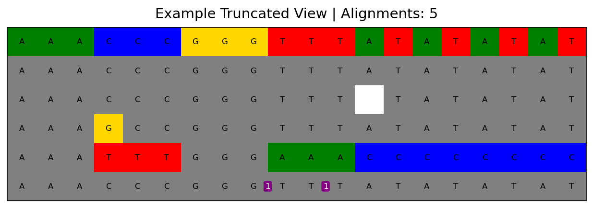
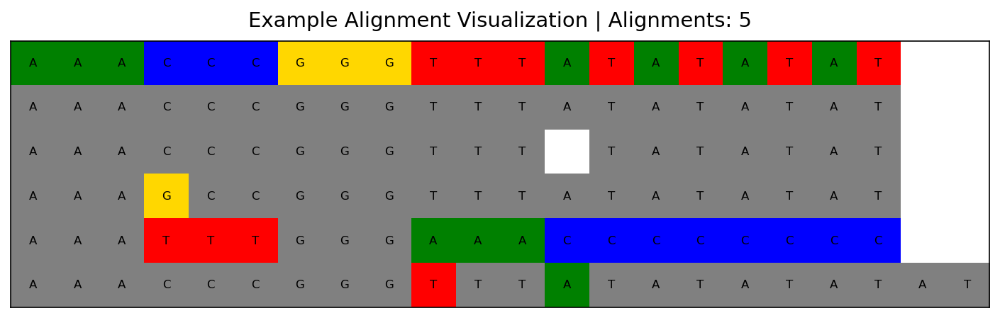

# PyIGV

Python alignment viewer library based on the Integrative Genomics Viewer (IGV) style for visualizing DNA/RNA sequence alignments.


## Overview

PyIGV provides a simple, intuitive way to visualize pairwise sequence alignments in Python. It displays alignments in an IGV-like format, with color-coded mismatches, insertions, and deletions.

## Installation

```bash
pip install pyigv
```

## Features

- **Color-coded visualization**: Mismatches are highlighted with base-specific colors (A=green, T=red, G=gold, C=blue)
- **Automatic alignment**: Uses Biopython's PairwiseAligner when alignment strings aren't provided
- **Gap handling**: Automatically detects and visualizes insertions and deletions
- **Mutation counting**: Tracks the number of insertions, deletions, and substitutions
- **PDF export**: Save alignment visualizations to PDF files
- **Flexible display**: Option to show full alignments or truncated views (hiding insertions)

## Quick Start

```python
from pyigv import Alignment, plot_alignments

# Define your sequences
target = "AAATAAA"
query = "AAAGAAA"

# Option 1: Auto-alignment (recommended)
aln = Alignment(target, query)

# Option 2: Provide pre-aligned sequences with gaps
alignment = ["AAATAAA", "AAAGAAA"]
aln = Alignment(target, query, alignment)

# Print alignment information
print(aln)
print(f"Mutations: {aln.mutation_ct}")
print(f"Insertions: {aln.insertion_ct}")
print(f"Deletions: {aln.deletion_ct}")

# Visualize alignments
alignments = [aln]
plot_alignments(alignments, title="Sample Alignment")
```

## Usage Examples

### Auto-Alignment (No Pre-alignment Required)

```python
from pyigv import Alignment

# PyIGV automatically aligns sequences using Biopython
target = "AAACCCGGG"
query = "AAATTTGGG"

aln = Alignment(target, query)
print(f"Mutations: {aln.mutation_ct}")
print(f"Insertions: {aln.insertion_ct}")
print(f"Deletions: {aln.deletion_ct}")
```

### Basic Alignment with Manual Alignment Strings

```python
from pyigv import Alignment

# Perfect match
target = "AAAA"
query = "AAAA"
alignment = ["AAAA", "AAAA"]
aln = Alignment(target, query, alignment)
print(f"Mutations: {aln.mutation_ct}")  # Output: 0
```

### Alignment with Mismatch

```python
# Single mismatch at position 3
target = "AAAA"
query = "AAAT"
alignment = ["AAAA", "AAAT"]
aln = Alignment(target, query, alignment)
print(f"Mutations: {aln.mutation_ct}")  # Output: 1
```

### Alignment with Insertion

```python
# Insertion in query
target = "AAAA"
query = "AAAAA"
alignment = ["AAAA-", "AAAAA"]  # '-' indicates gap in target
aln = Alignment(target, query, alignment)
print(f"Insertions: {aln.insertion_ct}")  # Output: 1
```

### Alignment with Deletion

```python
# Deletion in query
target = "AAAAA"
query = "AAAA"
alignment = ["AAAAA", "AAAA-"]  # '-' indicates gap in query
aln = Alignment(target, query, alignment)
print(f"Deletions: {aln.deletion_ct}")  # Output: 1
```

### Plotting Multiple Alignments

```python
from pyigv import Alignment, plot_alignments
import matplotlib.pyplot as plt

target = "AAACCCGGGTTTATATATAT"

# Create multiple query sequences
queries = [
    "AAACCCGGGTTTATATATAT",  # Perfect match
    "AAAGCCGGGTTTATATATAT",  # One mismatch
    "AAACCCGGGTTTTATATAT",   # One deletion
    "AAACCCGGGTTTATATATATAT", # One insertion
    "AAATTTGGGAAACCCCCCCC",  # Multiple changes
]

# Auto-align all queries against the target
alignments = [Alignment(target, query) for query in queries]

# Plot and display
plot_alignments(alignments, title="Multiple Query Comparison")
plt.show()
```

### Saving to PDF

```python
from pyigv import plot_alignments
from matplotlib.backends.backend_pdf import PdfPages

# Create your alignments
target = "AAATAAA"
queries = ["AAAGAAA", "AAACAAA", "AAAAAAA"]
alignments = [Alignment(target, q) for q in queries]

# Save to PDF
with PdfPages("alignment_output.pdf") as pdf:
    plot_alignments(alignments, title="My Alignments", pdf=pdf)
```

### Truncated View (Default)

By default, PyIGV uses truncated view to focus on the reference sequence. In truncated mode, insertions are displayed as purple boxes with numbers indicating insertion length:

```python
plot_alignments(
    alignments,
    title="Truncated View"
    # truncate=True is the default
)
```

To show full alignments including all insertions, set `truncate=False`:

```python
plot_alignments(
    alignments,
    title="Full View",
    truncate=False  # Show all insertions in full
)
```

## API Reference

### `Alignment` Class

#### Constructor

```python
Alignment(target: str, query: str, alignment: Optional[Sequence[str]] = None)
```

**Parameters:**
- `target`: The target (reference) sequence
- `query`: The query sequence
- `alignment` (optional): A list/tuple of two strings representing the aligned sequences with gaps marked as '-'. If not provided, uses Biopython's PairwiseAligner to automatically align the sequences.

#### Attributes

- `target`: Target sequence (without gaps)
- `query`: Query sequence (without gaps)
- `target_alignment`: Aligned target sequence with gaps
- `query_alignment`: Aligned query sequence with gaps
- `symbols`: Processed alignment symbols
- `edits`: Edit operations (I=insertion, D=deletion, M=mismatch, space=match)
- `insertion_ct`: Number of insertions
- `deletion_ct`: Number of deletions
- `mutation_ct`: Number of mismatches/substitutions

#### Methods

- `get_color_row(truncate: bool = False)`: Get color codes for visualization
- `get_symbols(truncate: bool = False)`: Get alignment symbols
- `get_insertion_indices()`: Get positions and lengths of insertions
- `__lt__(other)`: Compare alignments by number of edits (for sorting)

### `plot_alignments` Function

```python
plot_alignments(
    alignments,
    title: Optional[str] = None,
    pdf: Optional[str] = None,
    truncate: bool = True,
    return_fig: bool = False
) -> Optional[plt.Figure]
```

**Parameters:**
- `alignments`: List of Alignment objects to visualize
- `title` (optional): Title for the plot. If not provided, defaults to "Alignments"
- `pdf` (optional): PdfPages object for saving to PDF
- `truncate` (optional): If True (default), removes insertions from display and shows them as numbered purple boxes. Set to False to show full alignments.
- `return_fig` (optional): If True, returns the Figure object instead of None

**Returns:**
- matplotlib Figure object if `return_fig=True`, otherwise None

## Color Scheme

- **Green (A)**: Adenine mismatches or insertions
- **Red (T)**: Thymine mismatches or insertions
- **Gold (G)**: Guanine mismatches or insertions
- **Blue (C)**: Cytosine mismatches or insertions
- **Gray**: Matches
- **White**: Deletions
- **Purple boxes** (truncate mode): Insertion indicators with length

## Example Output

Here's what a typical PyIGV visualization looks like:

```python
from pyigv import Alignment, plot_alignments

target = "AAACCCGGGTTTATATATAT"
queries = [
    "AAACCCGGGTTTATATATAT",  # Perfect match
    "AAAGCCGGGTTTATATATAT",  # One mismatch
    "AAACCCGGGTTTTATATAT",   # One deletion
    "AAACCCGGGTTTATATATATAT", # One insertion
    "AAATTTGGGAAACCCCCCCC",  # Multiple changes
]

alignments = [Alignment(target, q) for q in queries]
plot_alignments(alignments, title="Example Alignment Visualization")
```

### Normal View


The output shows:
- The reference sequence in the top row
- Each query alignment in subsequent rows
- Color-coded differences (mismatches, insertions, deletions)
- Sorted by alignment quality (best matches first)

### Truncated View (Default)
By default, sequences with insertions are shown in truncated view with insertion counts as purple boxes:


```python
# Default behavior (truncate=True)
plot_alignments(alignments, title="Example Truncated View")
```

## Development

### Running Tests

```bash
# Install development dependencies
pip install -e ".[dev]"

# Run tests
pytest tests/

# Run specific test
pytest tests/test_alignment.py::test_plot_alignments_with_multiple_queries -v -s
```

### Code Quality

```bash
# Format code with Black
black src/ tests/

# Lint code
flake8 src/ tests/
```

## Requirements

- Python 3.7+
- numpy >= 1.19.0
- matplotlib >= 3.3.0
- biopython >= 1.86

## License

MIT License - see LICENSE file for details

## Contributing

Contributions are welcome! Please feel free to submit a Pull Request.

## Citation

If you use PyIGV in your research, please cite:

```
PyIGV: Python alignment viewer library
https://github.com/regev-lab/PyIGV
```

## Support

For issues, questions, or contributions, please visit:
- Issue Tracker: https://github.com/regev-lab/PyIGV/issues
- Source Code: https://github.com/regev-lab/PyIGV

## Changelog

### v0.1.0
- Initial release
- Color-coded alignment visualization
- Automatic alignment using Biopython
- PDF export support
- Truncated view mode for insertions
- Comprehensive test suite
